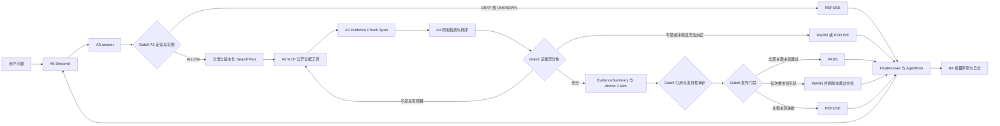

# OpenEvidence

面向临床医生、医学生与医学科研人员的可信医学证据智能助手。系统聚焦心脑血管病、高血压、血脂异常与糖尿病等方向，把自然语言问题转化为受限证据研究流程：检索公开文献、临床试验和已审核指南，形成带来源定位的原子主张，并在安全、证据充分性、引用支持性和发布门禁全部通过后输出回答。

> 当前仓库是赛道一工程发布基线，不等同于经过临床验证的诊疗产品。公开证据研究模式可用于教学与科研；个体化诊疗、急症处置、用药剂量调整等请求会严格拒答或提示寻求专业医疗帮助。

## 核心体验

- **先回答，再展示证据**：用户获得直接结论、关键发现、适用人群、不确定性和引用，而不是一堆未经解释的检索结果。
- **每个事实都可追溯**：发布主张必须绑定本轮 Evidence ID 和支持 Span；界面可以展开来源、年份、证据等级、定位与 provenance。
- **检索与生成分开诊断**：Trace 区分安全拒绝、检索不足、来源冲突、非法引用、Span 缺失、PICO/时间不匹配和不确定性过高。
- **默认保守**：未知安全状态、未知支持性、关键冲突、工具预算耗尽或关键证据不足均不会静默成为 PASS。
- **单一控制中心**：A5 是唯一 Agent 编排与发布决策层；A6 只消费 `AgentRun`，不重复检索、生成或门控逻辑。

## 项目全景思维导图

```mermaid
mindmap
  root((OpenEvidence 可信医学证据系统))
    产品目标
      用户
        临床医生
        医学生
        医学科研人员
      重点领域
        心血管病
        脑血管病
        高血压
        血脂异常
        糖尿病
      主要能力
        自然语言提问
        公开证据检索
        临床试验检索
        指南证据导航
        原子主张生成
        引用与证据定位
        局限性说明
        可审计运行记录
    A6 产品体验层
      角色
        AgentRun Viewer
        不做业务决策
        不直接访问 A1 A2 A3 A4
      页面
        检索问答
          问题输入
          推荐问题
          研究进度
        证据答案
          PASS WARN REFUSE 状态
          直接回答
          关键发现
          适用范围
          不确定性
        References
          Evidence 卡片
          支持 Span
          来源元数据
          版本与 provenance
        Workflow
          安全检查
          问题理解
          证据研究
          检索与排序
          主张验证
          引用审计
          发布门禁
        Knowledge Wiki
          主题导航
          相关问题
          原始证据入口
      安全展示
        Mock 明确标记
        Mock 不显示外部标识
        REFUSE 不呈现被拒主张
        技术 Trace 默认折叠
        AgentRun 不缓存
    A5 Agent 与可信生成
      唯一控制中心
        Question 输入
        answer 返回 AgentRun
        有限状态机
        依赖注入
      状态机
        START
        Gate0 Safety Scope
        CLASSIFY
        PLAN
        SELECT SKILL
        RETRIEVE
        Gate1 Evidence Integrity
        Gate2 Evidence Sufficiency
        SUMMARIZE EVIDENCE
        GENERATE CLAIMS
        SPLIT ATOMIC CLAIMS
        AUDIT CITATIONS
        Gate5 Claim Verification
        Gate6 Release
        FINALIZE
        END
      版本化 Skills
        evidence research
          Prompt
          manifest
          JSON Schema
          fixture
          SearchPlan
          EvidenceSummary
        citation audit
          Prompt
          manifest
          JSON Schema
          fixture
          Atomic Claim splitting
          Claim Evidence binding
      受限编排
        Skill Router
        Tool Budget Manager
        充分则提前停止
        不足且有预算则换来源
        预算耗尽则 WARN 或 REFUSE
      Gate2 检索充分性
        candidate count
        top quality
        source diversity
        evidence level
        freshness
        conflict count
        ranking 与 quality 严格分离
      Gate5 支持性验证
        Evidence 白名单
        Span 白名单
        文本支持扩展点
        PICO 一致性
        时间一致性
        数字与单位
        冲突检查
        uncertainty
      Gate6 发布
        PASS
          安全允许
          证据充分
          关键主张均支持
        WARN
          关键主张通过
          次要主张存在局限
          不发布未通过主张
        REFUSE
          安全未知或拒绝
          关键证据不足
          非法引用
          关键冲突
          高不确定性
      可观测性
        RuntimeConfigSnapshot
        Skill Prompt Gate Agent 版本
        Tool call index
        Tool budget remaining
        Evidence IDs
        Claim IDs
        latency
        reason codes
        JSON Trace
    A1 范围与安全规则
      职责
        研究范围判定
        风险信号分类
        SafetyDecision
      输出
        ALLOW
        DENY
        UNKNOWN
      Fail Closed
        UNKNOWN 直接 REFUSE
        分类异常直接 UNKNOWN
        Gate0 先于工具调用
      集成边界
        SafetyPolicy Port
        A1SafetyPolicyAdapter
        版本化规则资产
        待医学评审阈值
    A2 真实证据工具
      职责
        公开来源访问
        MCP Tool 边界
        Evidence 标准化
        错误 Envelope
      来源
        PubMed
        Europe PMC
        ClinicalTrials gov
        审核过的指南 Manifest
      Tool 能力
        search
        fetch detail
        validate citation
        health readiness
      约束
        只读
        不生成答案
        不伪造 PMID DOI NCT URL
        空结果与异常显式化
        Mock 必须 mock true
      接入 A3
        A2ToA3Normalizer
        不伪造 Span
        不伪造 PICO
        不伪造 Evidence level
    A3 知识与证据结构
      正式对象
        Evidence
        EvidenceChunk
        EvidenceSpan
        PICO
        Provenance
        Index Manifest
      数据治理
        document version
        content hash
        span offsets
        locator
        tombstone
        source metadata
      索引边界
        BM25 Index
        Vector Index
        EmbeddingProvider Port
        版本与 hash 一致性
      Wiki
        主题导航
        证据引用
        原始证据权威
      Embedding 原则
        模型归 A3 冻结
        A4 不重复加载模型
        BGE M3 默认禁用
        DEV Recall at 50 后才可启用
        记录模型 revision 与重建结果
    A4 检索与排序
      一次候选池
        BM25
        Vector Search
        RRF Fusion
        immutable pool hash
      条件
        R0
          BM25 Vector RRF
        R1
          Feature rerank
          MMR diversity
        R2
          calibrated Cross Encoder
          无校准则 PENDING
        R3
          R2 加 support gate
          全删返回 EMPTY
      可审计信号
        lexical score
        vector score
        rrf score
        feature score
        rerank score
        stage trace
      关键边界
        query local ranking 不是质量概率
        raw logits 不是概率
        CalibratedQualityScorer 才能供 Gate2
        索引版本不一致 fail closed
        相同问题只构建一次候选池
    后端组合层
      Public Evidence Research
        ConservativeResearchSafetyClassifier
        PublicEvidenceResearchSkill
        A2 MCP Client
        CoordinatedEvidenceRetriever
        A3 Evidence Span Adapter
        A4 R1 ranking
        ResearchEvidenceSufficiencyGate
      生成路径
        结构化模型可用
          OpenAI compatible structured transport
          Claim JSON Schema
          独立 semantic verifier
        结构化模型不可用
          Exact span extractive claims
          Pre atomic splitter
          保守相关性过滤
      展示路径
        Gate5 后才允许改写
        数字 术语 方向 引用约束
        校验失败回退到已验证原句
      运行模式
        research
          公开来源研究
          开发阈值如实记录
        live
          必须显式生产依赖
          Readiness 未通过不得构建
        replay
          下游契约回归
        mock
          离线状态机回归
    稳定契约
      Question
      EvidenceLike
      Claim
      VerificationResult
      FinalAnswer
      AgentRun
        decision
        answer
        evidence
        claims
        trace
        runtime snapshot
      AgentRunView
        A6 安全投影
      JSON Schema
        A2 v1
        A3 v0.3
        A5 v0.4.0
      下游
        A6 产品界面
        B4 批量实验
    可信保证
      来源真实性
        禁止伪造外部标识
        URL 安全投影
        provenance 可追溯
      生成约束
        Evidence ID 白名单
        Span ID 白名单
        不自由生成引用
        原子主张逐条核验
      分数语义
        排序相关性
        证据支持性
        跨问题质量
        三者不可混用
      失败策略
        无证据拒答
        未知安全拒答
        未知支持不通过
        上游异常不回退 Mock
      合规状态
        工程架构可运行
        公开研究模式可用
        临床阈值待审核
        正式医学评测待完成
    工程与发布
      Python 3.11
      Pydantic v2
      Streamlit
      MCP Python SDK
      Pytest
      Pixi 锁定环境
      配置资产
        config
        prompts
        manifests
        schemas
      验证命令
        pixi run test
        pixi run demo
        pixi run backend demo
        pixi run a6 test
      发布检查
        全量测试
        Trace 再生成
        Schema 一致性
        Mock 标识扫描
        凭据扫描
        Git diff 审查
```



## 一次请求如何运行



## 模块职责与禁止越界

| 模块 | 负责 | 不负责 |
|---|---|---|
| A1 | 问题范围、安全信号、拒答策略 | 检索与生成 |
| A2 | 公开来源工具、MCP、Evidence 获取与标准化 | 判断答案或证据是否足够 |
| A3 | Evidence/PICO/Chunk/Span、provenance、索引与 Wiki | 发布决策 |
| A4 | 候选检索、融合、rerank、MMR、消融与分数语义 | 把相关性当医学支持性 |
| A5 | FSM、Skill、预算、Gate2/Gate5/Gate6、Claim 与 Citation Audit | 重写采集、索引或 rerank |
| A6 | 输入、答案、证据、Trace、Wiki 的产品展示 | 复制 A5 业务逻辑 |
| B4 | 批量消费 AgentRun 并评测与保存日志 | 改变单次运行结果 |

## 快速开始

### 环境要求

- Windows 10/11；
- Git；
- [Pixi](https://pixi.sh/)；
- Python 由 `pixi.lock` 锁定，无需手工安装；
- 公开研究模式需要访问 PubMed、Europe PMC 与 ClinicalTrials.gov；
- Ollama 为可选项，未运行时系统自动使用保守的 Span 抽取路径，不会伪装成模型生成。

### 安装

```powershell
git clone https://github.com/neko-claw/OpenEvidence_trace1.git
cd OpenEvidence_trace1
pixi install --locked
Copy-Item .env.example .env
```

如需提高 NCBI 访问稳定性，在本机 `.env` 或 PowerShell 环境变量中填写身份信息，不要提交密钥：

```powershell
$env:NCBI_EMAIL = "your-email@example.org"
$env:NCBI_TOOL = "OpenEvidence"
$env:NCBI_API_KEY = ""
```

### 启动产品界面

```powershell
pixi run app
```

浏览器访问 [http://127.0.0.1:8501](http://127.0.0.1:8501)。默认运行 `research` 模式，用户问题会实际经过 A1→A2→A3→A4→A5，再由 A6 渲染 `AgentRun`。

可选的本地结构化模型配置位于 `config/research_profile.json`。当 Ollama 中存在配置模型时，系统启用结构化 Claim 生成和独立语义验证；否则使用逐字 Span 支持的保守降级路径。任何路径都必须通过 Evidence/Span 白名单与 Gate5。

## 运行模式

| 模式 | 用途 | 数据 | 安全行为 |
|---|---|---|---|
| `research` | 默认面向用户的公开证据研究 | PubMed、Europe PMC、ClinicalTrials.gov、审核指南 | 运行完整 A1–A5；阈值与生成路径写入 Run snapshot |
| `live` | 经批准的生产组合 | 显式注入的生产依赖 | 任一 readiness 未通过即拒绝构建，不回退测试数据 |
| `replay` | A6/B4 契约回归 | 版本化 PASS/WARN/REFUSE/ERROR fixture | 仅用于自动化测试，记录明确标记 |
| `mock` | 离线 FSM 与 Gate 回归 | `mock=true` 合成记录 | 禁止外部医学标识和 URL，不冒充真实证据 |

切换自动化测试模式：

```powershell
$env:OPENEVIDENCE_APP_MODE = "replay"
pixi run app
```

页面不会提供把测试数据伪装成正式证据的开关。

## 验证

发布前必须执行：

```powershell
pixi run test
pixi run demo
pixi run backend-demo
pixi run a6-test
```

- `pixi run test`：全仓库单元、契约、架构与协同测试；
- `pixi run demo`：生成 A5 PASS/WARN/REFUSE Trace；
- `pixi run backend-demo`：验证 A1→A2 MCP→A3→A4→A5 离线协同；
- `pixi run a6-test`：使用 Streamlit AppTest 验证启动、问答、Evidence、Trace、Wiki、分页和错误状态。

Trace 产物位于 `artifacts/`。`replay` 和 `mock` 产物只用于工程验证，不构成医学效果结论。

## 目录结构

```text
OpenEvidence_trace1/
├── a1/                         # 问题范围、安全规则与 SafetyPolicy Adapter
├── a2/                         # Evidence Schema、公开来源 connector 与 MCP tools
├── a3/                         # Evidence/PICO/Chunk/Span、索引与 Wiki
├── retrieval/                  # A4 BM25/Vector/RRF/rerank/MMR/消融
├── a5/                         # FSM、Skills、Gates、Claims、Citation Audit
├── backend/                    # A1–A5 组合所需的可替换 Adapter
├── deployment/track1_backend/ # 稳定 BackendService 与 research/live composition
├── app/                        # A6 Streamlit 产品体验层
├── contracts/                  # A2/A3/A5 版本化 JSON Schema 与 replay fixture
├── prompts/                    # 版本化结构化生成与验证 Prompt
├── config/                     # Agent、Gate、检索、来源与研究模式配置
├── schemas/                    # 跨模块契约资产
├── evaluation/                 # A3/A4/A5 正式评测 preflight 与批处理逻辑
├── artifacts/                  # 可复现 Trace 与工程验收产物
├── tests/                      # 单元、契约、集成、架构、AppTest
├── docs/                       # 正式规划、架构、契约与合规说明
├── main.py                     # A5 状态机命令行入口
├── pixi.toml                   # 可复现任务定义
└── pixi.lock                   # Windows 发布环境锁文件
```

## 稳定公共接口

面向 A6/B4 的服务入口：

```python
from deployment.track1_backend import build_service

service = build_service("research")
run = service.answer("高血压患者的降压目标有哪些最新证据？")

print(run.decision)
print(run.final_answer)
print(run.retrieved_evidence)
print(run.trace)
```

A6 只能通过 `app/services/agent_service.py` 调用该公共服务。其他 UI 模块不得直接 import A1、A2、A3、A4、A5 或检索实现。

核心契约：

- `AgentRun`：B4 与审计使用的完整运行记录；
- `AgentRunView`：A6 使用的安全投影；
- `contracts/a5/v0.4.0/`：对应 JSON Schema 和 replay fixture；
- `RuntimeConfigSnapshot`：实际生效的 Agent、Skill、Prompt、Gate、来源和模型配置快照。

## 可信生成方法依据

本项目只借鉴公开工作的控制模式，不复制完整系统，也不把论文指标当作本项目医学验证结果：

- [CRAG](https://arxiv.org/abs/2401.15884)：检索质量先评估，再继续、纠正或停止；
- [FActScore](https://arxiv.org/abs/2305.14251)：长答案拆分为可独立核验的原子事实；
- [ALCE](https://arxiv.org/abs/2305.14627)：区分引用有效性、支持精度、覆盖率和相邻主张支持；
- [RAGChecker](https://arxiv.org/abs/2408.08067)：分别诊断检索错误与生成错误；
- [MCP Python SDK](https://github.com/modelcontextprotocol/python-sdk)：将 A2 工具作为标准化、可替换边界；
- [Streamlit](https://github.com/streamlit/streamlit)：构建只消费稳定 AgentRun 的产品体验层。

详细工程映射见 `docs/backend_integration_architecture.md` 与 `docs/DESIGN_REFERENCES.md`。

从仓库检查、A1–A6 集成、主要碰壁与修复，到本地/GitHub/Community Cloud
部署和岗位交接的完整记录，见
[`docs/project_deployment_report.md`](docs/project_deployment_report.md)。

## 当前完成度与生产边界

已具备：

- A1–A5 受限状态机与端到端组合；
- PubMed、Europe PMC、ClinicalTrials.gov 公开证据研究路径；
- A3 Evidence/Span provenance 与 A4 同候选池检索排序；
- A5 Gate0、Gate1、Gate2、Gate5、Gate6 与 PASS/WARN/REFUSE；
- A6 中文问答、证据引用、Workflow、Wiki 和响应式产品界面；
- 版本化 Prompt、Skill、Schema、fixture、Trace 与配置快照；
- 可替换模型、Embedding、质量评估器和上游 Adapter 边界。

仍需正式外部交付或审核后才能称为临床级生产能力：

- A1 医疗安全政策与阈值的医学负责人批准；
- 指南许可清单、来源治理和生产凭据；
- A3 Embedding 的独立 DEV Recall@50、延迟与可复现重建报告；
- A4 Cross-Encoder/quality scorer 的独立校准、ECE/Brier 和正式同池消融；
- A5 医学语义 verifier 的独立 gold、阈值校准与正式效果评测；
- 隐私、审计、部署监控和医疗器械合规评估。

这些未完成项不会被本地模型、相关性分数、Mock fixture 或 README 声明替代。`live` 模式会保持 fail-closed。

## 贡献与发布规则

- 保持 `answer(...)->AgentRun` 与 A5 FSM 稳定，优先新增 Adapter；
- 所有阈值和版本进入 `config/`、Prompt、Skill 或 manifest，并保存在 Run snapshot；
- Mock 必须 `mock=true`，不得携带伪造 PMID、DOI、NCT、URL 或指南编号；
- query-local rerank 分数不得作为 Gate2 跨问题质量概率；
- 未知安全或支持数据不得默认 ALLOW/SUPPORTED；
- 提交前执行全量测试、Trace 再生成、Schema/凭据/Mock 标识扫描与 diff 自审。

## 免责声明

OpenEvidence 当前用于医学证据研究、教学和工程验证，不替代医生判断、正式指南、监管要求或个体化医疗建议。遇到急症、个体用药与诊疗决策，请使用正式医疗服务和经授权的临床系统。
