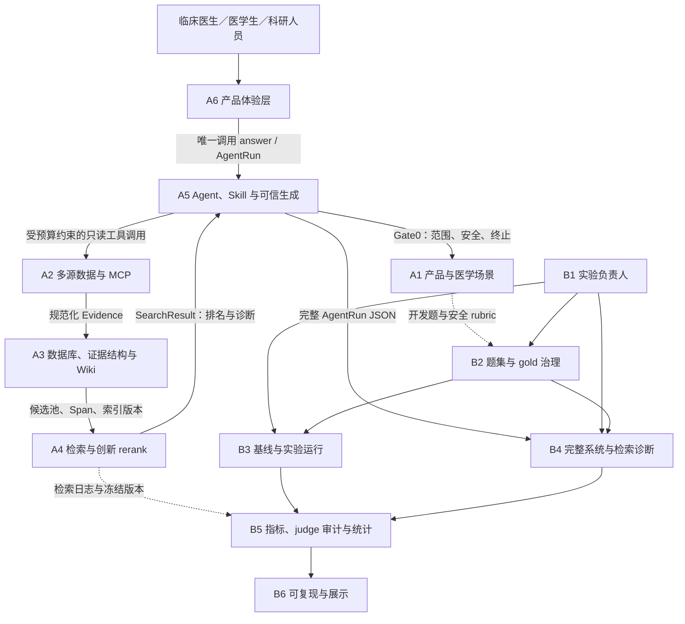

# OpenEvidence 项目全流程部署、方法依据与职责关系报告

> 文档版本：v1.0
>
> 记录日期：2026-08-12（Asia/Shanghai）
>
> 规范基线：`docs/OpenEvidence_MVP_赛道1与赛道3实施规划.md`
>
> 本文记录的功能代码基线：GitHub `main`，commit `e06d24b417a4a20e4a4024408cb895e9bf7a4f5e`

## 0. 先说明“部署完成”具体指什么

本项目把部署状态分为三个层次，三者不能混为一谈：

| 层次 | 当前状态 | 可验证证据 | 结论 |
|---|---|---|---|
| 代码发布到 GitHub `main` | **DONE** | `origin/main=e06d24b` | 代码、README、依赖和测试已发布 |
| 本机完整运行 | **DONE** | Streamlit `/_stcore/health=200`；公开来源 smoke 通过 | 可在开发机运行完整 A1→A6 链路 |
| Streamlit Community Cloud 公网发布 | **PENDING EXTERNAL AUTHORIZATION** | 预填部署页已准备；目标 URL 当前仍为 404 | 尚不能宣称已有公网产品链接 |

公网发布未完成的唯一剩余操作是：仓库管理员登录 Streamlit Community Cloud，完成 GitHub OAuth 授权并点击 Deploy。该授权必须由账号所有者本人确认，不能通过本地 Git/GitHub CLI 代替。

因此，本报告使用以下措辞：

- “后端架构完成”表示工程控制流、契约和离线/公开来源 smoke 可运行；
- “代码已发布”表示 GitHub `main` 已更新；
- “本地部署完成”表示本机 Web 服务健康；
- “公网部署完成”只有在 `https://*.streamlit.app/_stcore/health` 返回 200 后才能使用；
- 任何工程 PASS 都不等于“临床验证完成”。

---

## 1. 项目目标与最终形态

OpenEvidence 面向临床医生、医学生和医学科研人员，聚焦心脑血管病、高血压、血脂异常和糖尿病。系统不是证据列表浏览器，也不是自由聊天模型，而是一条受限的医学证据研究链：

```text
用户问题
  → A1 判断范围与安全
  → A5 规划问题和来源
  → A2 调用公开证据工具
  → A3 规范化 Evidence / Chunk / Span / PICO / provenance
  → A4 在同一候选池中检索、融合和 rerank
  → A5 判断证据是否充分
  → A5 生成原子 Claim
  → A5 逐条做 Citation Audit 和支持性验证
  → A5 决定 PASS / WARN / REFUSE
  → A6 展示答案、证据、局限和 Trace
  → B4 保存完整 AgentRun 做批量实验与诊断
```

最终用户首先看到“回答和适用范围”，然后可以向下核对引用、支持片段、来源、时间、证据等级和工作流。系统不把排序分数包装成医学可信度，也不把找到了文献等同于得到了可靠回答。

---

## 2. 总体架构与各岗位关系



### 2.1 A 组岗位：赛道一产品链

| 岗位 | 规划主责 | 本仓库已经完成 | 交给谁 | 尚未完成或需外部确认 |
|---|---|---|---|---|
| A1 产品与医学场景 | 题型、范围、安全边界、拒答和终止规则、来源覆盖矩阵 | Safety schema、结构化风险信号、`SafetySignalClassifier` Port、`A1SafetyPolicyAdapter`、Gate0 fail-closed、题库蓝图和安全文档 | A5 Gate0；B2 题集设计 | 医学负责人审批最终政策和阈值；正式题/qrel 审核 |
| A2 多源数据与 MCP | PubMed、Europe PMC、ClinicalTrials、指南连接器；缓存、去重、只读 MCP | Evidence v1、错误 envelope、6 个只读 MCP 工具、公开来源 connector、A2→A3 normalizer、Mock 外部标识禁令 | A3 数据结构；A5 工具调用 | NCBI 生产身份、速率策略、指南许可清单、生产监控 |
| A3 数据库与 LLM Wiki | Evidence/PICO/Span、切块、Embedding、BM25/向量索引、Wiki | Evidence/Chunk/Span/SearchHit/IndexManifest、hash/offset/provenance、BM25、Chroma 边界、Wiki 导航、`EmbeddingProvider` Port | A4 候选池；A5 引用验证；A6 Wiki | 冻结正式 Embedding；独立 DEV Recall@50、延迟和可复现重建报告 |
| A4 检索与创新 rerank | Query 解析、BM25+dense、RRF、特征 rerank、MMR、可选 Cross-Encoder、消融 | 不可变同池候选、R0–R3、特征日志、pool hash、stage trace、排名/质量语义隔离、缺校准 fail-closed | A5 Gate2；B4/B5 实验日志 | 正式同池消融；如启用 R2/R3，需 CE 校准、ECE/Brier、nDCG/支持率/延迟报告 |
| A5 Agent、Skill 与可信生成 | 两个 Skill、受限 Agent、Prompt、Claim、Citation Audit、拒答、Trace | 版本化 Skill/Prompt/Schema/fixture、FSM、Tool Budget、Gate0/1/2/3/4/5/6、原子 Claim、白名单和 Span 验证、PASS/WARN/REFUSE、AgentRun | A6 展示；B4 批处理 | 独立医学 verifier、正式医学 gold 和阈值校准 |
| A6 应用与集成 | Streamlit、答案/Evidence/Trace/Wiki、错误状态、运行和发布 | 中文产品界面、answer-first 布局、Evidence 卡、引用列表、Workflow 时间线、分页、Session State、AppTest、云端依赖 | 最终用户 | Community Cloud OAuth+Deploy；未来可接 A5 streaming |

### 2.2 B 组岗位：赛道三实验链

赛道三并未在本轮被完整实现。表中严格区分“已有可复用基础设施”和“正式实验交付”。

| 岗位 | 规划主责 | 当前可复用基础 | 当前状态 |
|---|---|---|---|
| B1 实验负责人 | 冻结 A/A2/B/C/D/E 条件、公平性和版本 | 配置快照、系统版本、R0–R3 条件契约已存在 | **PARTIAL**：正式实验协议尚待冻结 |
| B2 题集与 gold 治理 | 题目来源、真实 gold、qrel、盲评和偏差控制 | A1 题库蓝图、manifest/qrel schema 与 preflight | **BLOCKED_EXTERNAL**：缺审核后的 gold/qrels |
| B3 基线与实验运行 | Closed-book、通用搜索和基础 RAG 批量运行 | 统一 JSON 契约和测试 fixture 可作 runner 输入 | **PENDING**：完整 A/A2/B runner 尚未交付 |
| B4 完整系统与检索诊断 | C/D/E 完整系统、压力劣化、检索/工具日志 | `AgentRun`、RuntimeConfigSnapshot、Trace、pool hash、rank log 已冻结 | **PARTIAL**：单次契约完成，批量调度入口待实现 |
| B5 指标与统计 | 自动指标、双 judge 偏差、人工一致性、置信区间和图表 | Recall/MRR/nDCG、span/claim proxy 和 preflight 代码存在 | **PARTIAL**：不能用 smoke 数据替代正式统计 |
| B6 可复现与展示 | 一键实验、结果浏览、README 和展示 | Pixi 任务、JSON/CSV artifact、A6 Trace 展示可复用 | **PENDING**：完整赛道三报告和重跑包待完成 |

### 2.3 为什么必须这样分工

1. **A1 不能直接检索**：安全规则需要独立于来源和模型，便于医学负责人审阅。
2. **A2 不能判断答案**：数据连接器只负责忠实获取和标准化，避免“采集层偷偷决定结论”。
3. **A3 不决定发布**：Evidence/PICO/Span 是数据事实，不是回答充分性判断。
4. **A4 不判断医学蕴含**：rerank 只回答“相对当前 query 哪条更相关”，不能回答“这条证据是否支持 Claim”。
5. **A5 是唯一控制中心**：预算、纠错、主张、引用和发布必须处于同一可审计 FSM，避免 UI 或 Adapter 绕过门禁。
6. **A6 只渲染 AgentRun**：前端没有第二套医学逻辑，后端修复会自动反映到 UI。
7. **B4/B5 只读运行记录**：实验层不能为了得到更好的图表而改变线上回答。

---

## 3. 从仓库现状到发布版本的完整过程

### Phase 0：检查仓库与保护用户工作

执行内容：

- 阅读根目录工程规则、正式规划、README、INTEGRATION、测试配置；
- 检查分支、远端、最近提交和未提交修改；
- 枚举 A1–A6、contracts、schemas、fixtures、artifacts 和 tests；
- 不覆盖不属于本任务的用户修改；
- 把 `log.md` 固定为本地工作日志并加入 `.gitignore`。

碰壁：复制到另一台机器的目录曾经是 Git worktree，`.git` 只是指向旧机器元数据的文本链接，导致 `git status` 无法工作。

处理：

1. 保留原目录作为只读源码快照；
2. 排除 `.git`、`.pixi`、缓存、模型、本地数据库和凭据后复制源码；
3. 通过文件 hash 核对内容；
4. 重新建立独立 Git 历史并在网络恢复后对比远端；
5. 最终从最新 `origin/main` 建立隔离发布 worktree，避免污染仍在运行的开发目录。

为什么这么做：Git 历史和源码内容是两件事。直接 `reset --hard` 或用旧远端覆盖快照，可能让已经完成但未推送的代码永久丢失。

### Phase 1：上游不齐时冻结 Port，而不是冻结假接口

早期 A1/A2/A3/A4 正式交付不完整。A5 没有停工，也没有把 Mock 写进核心流程，而是建立：

```text
A5 Workflow
  → SafetyPolicy Port        → 临时策略 / A1 Adapter
  → EvidenceRetriever Port   → Mock / A2+A3+A4 Adapter
  → ClaimGenerator Port      → Mock / Structured model / Extractive fallback
  → ClaimVerifier Port       → Rule-based / semantic verifier
```

碰壁：若直接按猜测定义最终 Evidence/PICO/MCP/search schema，真实上游到达后 A5 必须推倒重写。

处理：只保留 A5 当前真正需要的兼容字段；未知 PICO、Span、Evidence level、质量分保持 `null/UNKNOWN`；后续以 Adapter 消化真实 Schema 差异。

结果：A1–A4 到达后主要替换 Adapter 和 composition root，A5 FSM 与 `answer(...)->AgentRun` 保持稳定。

### Phase 2：修复 A5 Review 的五类阻断

最初 A5 虽能跑通，但存在“字段写了、约束没执行”的问题：

| 阻断 | 原问题 | 修复 |
|---|---|---|
| B1 Skill 资产 | Skill 只是 Python 类，无 manifest/Prompt/Schema/fixture；缺 EvidenceSummary 和 Claim splitting | 建立版本化 `evidence_research`、`citation_audit` 资产与一致性测试 |
| B2 编排约束 | `max_tool_calls` 存在但未真正限制；Skill 写死；证据不足不纠正 | 实现 ToolBudgetManager、SkillRouter、Gate2 后换来源、充分提前停、预算耗尽终止 |
| B3 Gate2/Gate5 | 仅看是否有 Evidence；verifier 读取 fixture 预埋支持标签 | 删除 gold shortcut；加入候选数、来源、时效、冲突与 Evidence/Span/PICO/time/uncertainty 检查 |
| B4 安全方向 | 默认 ALLOW | `ALLOW/DENY/UNKNOWN` 三态，UNKNOWN 和异常一律 REFUSE；Gate0 位于工具之前 |
| B5 Prompt/Config/Version | 阈值和版本散落在 Python | Prompt、Skill、Agent、Gate 和阈值资产化；实际值写入 RuntimeConfigSnapshot |

为什么这么做：可信系统的关键不是“有一个叫 Gate 的函数”，而是测试必须证明失败路径真的阻断了工具、生成或发布。

### Phase 3：A1 安全与范围接入

完成内容：

- 将自由文本信号提取抽象为 `SafetySignalClassifier`；
- `A1SafetyPolicyAdapter` 消费冻结的结构化输入；
- 缺 classifier、异常、缺字段或低置信输出均为 UNKNOWN；
- Gate0 在 CLASSIFY、RETRIEVE、GENERATE 之前执行；
- 对急症、个体剂量/处方等范围设置保守阻断；
- 研究模式限制在规划中的心脑血管、血脂、高血压和糖尿病主题。

碰壁：临时开发策略若默认允许，会让未冻结的 A1 医疗规则变成隐形生产规则。

处理：默认 fail-closed，并把开发研究 classifier 与未来 A1 医学审批 Adapter 分开。

### Phase 4：A2 多源工具与 A2→A3 归一化

完成内容：

- PubMed、Europe PMC、ClinicalTrials.gov 和审核指南 manifest 的 connector；
- MCP 工具：搜索、详情、引用验证和健康检查；
- 统一 ToolResponse/Error envelope；
- `A2ToA3Normalizer` 负责字段映射，不导入 A5；
- Mock 记录必须 `mock=true`，并禁止伪造 PMID、DOI、NCT、URL 和指南编号；
- 公开来源 research smoke 实际返回 8 条非 Mock Evidence，来源为 PubMed 和 Europe PMC。

碰壁：早期 fixture 和旧 artifact 中出现过看起来像真的、实际未核验的外部标识。

处理：将合成数据改成内部 `MOCK-*` ID，清空外部标识；真实外部标识只允许来自公开 API 或经核验记录；发布前执行扫描。

### Phase 5：A3 Evidence、Span、索引与 Embedding 边界

完成内容：

- Evidence、Chunk、EvidenceSpan、PICO、SearchHit、IndexManifest；
- document-relative 与 chunk-relative offset、content hash、evidence hash、tombstone/live state；
- BM25 和 Chroma index；
- A2 Evidence 归一化后经 A3 runtime model 验证；
- A3 lexical/vector hit 进入 A4 initial pool 时保留 Span refs 和版本；
- Embedding 只通过 `EmbeddingProvider` 注入。

碰壁：“直接启用 BGE-M3”看似能迅速增加语义检索，但没有本项目 DEV Recall@50、延迟、版本和索引重建证据，且会在 A3、A4 各自加载一套模型。

处理：

- BGE-M3 保留为 A3 候选 provider，默认禁用；
- A4 不加载 BGE-M3，只消费 A3 vector hit/provider；
- research 路径用明确标记的 hashing candidate-recall provider，实际配置写入 Run snapshot；
- 正式启用必须提交模型 ID、revision、DEV Recall@50、延迟和可复现重建报告。

为什么这么做：Embedding 决定索引空间。若检索层临时更换模型，原有向量索引、评测结果和版本追踪全部失效。

### Phase 6：A4 检索、rerank 与两个“雷区”

完成内容：

```text
R0 = BM25 + Vector + RRF
R1 = R0 + 可解释特征 rerank + MMR
R2 = R1 + 显式校准 Cross-Encoder
R3 = R2 + Claim-Evidence support gate
```

所有条件使用同一不可变 `InitialCandidatePool`，保存 `pool_hash` 和 `stage_trace`。消融不会为不同条件重新检索一次，从而避免来源漂移。

#### 雷区一：把 rerank score 当证据可信度

Cross-Encoder、BM25、vector、RRF 和 feature score 都是 query-local ranking signal，只能比较同一个问题内候选的相对位置。它们不是跨问题可比的证据质量概率，更不是 Claim entailment。

处理：

- `SearchResult` 分离 ranking signal 与可选 calibrated quality；
- 只有显式 `CalibratedQualityScorer` 才能给 A5 Gate2 质量分；
- raw Cross-Encoder logit 保持 raw/PENDING；
- 未校准时 R2/R3 fail closed；
- A4 support hint 只能做诊断，不能直接把 A5 Claim 标成 SUPPORTED。

#### 雷区二：用 BGE-M3 名称替代项目验证

BGE-M3 的公开论文和 benchmark 说明模型能力，但不能证明它在本项目中文医学问题、当前 corpus 和硬件上优于其他方案。

处理：默认不加载；将模型选择和索引版本归 A3；只有正式 DEV 比较后才允许切换 capability。

#### 集成时遇到的回退风险

整合目录形成时间早于 `main` 中最新 A4 round2/round3 修复。若整目录覆盖，会丢失：

- question type 优先级修复；
- source-quality 表驱动权重；
- freshness 只在明确要求时启用；
- index version mismatch 的 fail-closed；
- rerank/quality 语义隔离。

处理：逐文件比较，只合入 A1/A2/A5/A6/research 的安全增量，明确不覆盖 `retrieval/` 的新版文件。最终全量回归通过。

### Phase 7：A5 可信生成与发布门禁

最终 FSM：

```text
START
  → GATE0
  → CLASSIFY
  → PLAN
  → SELECT_SKILL
  → RETRIEVE
  → GATE1
  → GATE2
  → SUMMARIZE_EVIDENCE
  → GATE3
  → GATE4
  → GENERATE_CLAIMS
  → CLAIM_SPLITTER
  → AUDIT_CITATIONS
  → GATE5
  → GATE6
  → FINALIZE
  → END
```

关键策略：

- Tool Budget 每次调用前检查，达到预算后禁止 N+1 次调用；
- Gate2 充分时提前停止，不机械跑满来源；
- 证据不足且有预算时换来源；不足且预算耗尽时 REFUSE；
- Claim 必须原子化并绑定本轮 Evidence/Span 白名单；
- 不读取 fixture 中的 `supports_claim_ids` 作为推断；
- exact span 可以给出确定性支持；paraphrase/未知语义没有独立 verifier 时保持 INSUFFICIENT；
- critical Claim 的 HIGH/UNKNOWN uncertainty 不能静默 PASS；
- Finalizer 只发布 SUPPORTED Claim，未通过的非关键 Claim 从回答中删除并写入 limitations。

### Phase 8：面向使用的 research 组合

为了让产品不是只会 replay fixture，又不把未验证模型冒充生产能力，增加独立 `research` 模式：

- A1：保守范围 classifier；
- A2：公开来源 MCP；
- A3：动态 Evidence/Chunk/Span 和 transient index；
- A4：R1 排名，但 ranking semantics 明确为 query-local；
- A5：ResearchEvidenceSufficiencyGate；
- 结构化模型可用时：JSON Claim generator + 独立 semantic verifier；
- Ollama 不可用时：逐字 Span 抽取 + 原子拆分 + exact-span verifier；
- 可选中文展示模型只能在 Gate5 后改写，术语、数字、方向或引用校验失败时回退已验证原句。

这条“双路径”是工程降级，而不是两套业务逻辑。两者都经过相同的 Evidence/Span 白名单和 Gate6。

### Phase 9：A6 产品体验重构

早期界面总体可运行，但功能偏成“盲目展示证据”，与目标用户需要的“带引用回答”不一致。

处理：重构为 answer-first 医学证据工作台：

- 左侧：提问、引用来源、知识导航、关于；
- 顶部：本轮问题；
- 主区：Decision、直接回答、关键发现、适用范围和 References；
- 右侧：Workflow 和 Evidence Summary；
- Trace 默认折叠，不把 BM25/RRF/MMR 等实现细节放在普通用户首屏；
- PASS/WARN/REFUSE 不只换颜色，还显示不同文案、限制和下一动作；
- Mock 只在 replay/mock 自动化路径出现，并明确标记“测试数据”；
- 只有 `app/services/agent_service.py` 能调用 A5 公共 API。

为什么这么做：A6 是 `AgentRun Viewer`，不是第二个 Agent。如果 UI 自己判断 Evidence 是否充分或重新生成答案，会绕过 A5 的门禁和审计。

### Phase 10：清理 `main` 和重写发布 README

发布前完成：

- 删除 README 备份、换机恢复记录、成员提示词、过期 provisional Adapter 报告和旧交接状态；
- 保留正式规划、A1/A2 契约、A3/A4 设计、review compliance、Schema 和评测资产；
- 扫描删除文件的断链引用；
- 扫描凭据、伪造外部标识和不应出现在正式仓库的工具品牌字样；
- 重写发布 README，加入约 380 个节点的 Mermaid 项目思维导图；
- README 明确区分 research、live、replay、mock 和临床生产边界。

碰壁：直接把所有历史报告都删除会损失正式验收证据；全部保留又会让用户面对互相冲突的旧状态。

处理：按“是否仍是契约/合规/设计 source of truth”分类，只删除被发布文档完全取代的过程材料。

### Phase 11：本地部署与真实公开来源 smoke

本地部署命令：

```powershell
git clone https://github.com/neko-claw/OpenEvidence_trace1.git
cd OpenEvidence_trace1
pixi install --locked
pixi run app
```

本地验收：

```powershell
pixi run test
pixi run demo
pixi run backend-demo
pixi run a6-test
```

最终测试结果：

- 全仓库：**582 passed, 3 skipped**；
- A6 AppTest：**27 passed**；
- 3 个 skipped 是显式 opt-in 的 live-network 测试，不被计算为 live 通过；
- A5 PASS/WARN/REFUSE demo：通过；
- A1→A2 MCP→A3→A4→A5 backend demo：通过；
- Streamlit health：`HTTP 200 / ok`；
- 公开研究 smoke：PASS，8 条非 Mock Evidence，来源 PubMed 和 Europe PMC，Gate0→Gate6 Trace 完整，`error=None`。

上述 smoke 证明“控制链能工作”，不证明医学效果达到临床部署标准。

### Phase 12：发布到 GitHub `main`

为避免在仍运行的目录中直接改 main，发布过程采用隔离 worktree：

1. `git fetch origin main`；
2. 以最新 `origin/main` 建立隔离发布目录；
3. 精确合入安全增量，不覆盖 A4 新修复；
4. 运行测试和 diff/secret/mock-ID/断链扫描；
5. 提交发布 commit `7b23f80`；
6. 再次 fetch，确认远端 main 仍是本地基线祖先；
7. 非 force push 到 `main`；
8. 云端依赖修复后再提交 `e06d24b`；
9. 再次确认 `HEAD == origin/main == e06d24b`。

为什么不 force push：主分支可能有其他成员的新提交。只有 fast-forward 才能证明没有重写别人历史。

### Phase 13：Streamlit Community Cloud 公网部署

官方部署参数：

| 字段 | 值 |
|---|---|
| Repository | `neko-claw/OpenEvidence_trace1` |
| Branch | `main` |
| Main file path | `app/main.py` |
| Python | `3.11` |
| 建议 App URL | `openevidence-trace1` |

预填入口：

`https://share.streamlit.io/deploy?repository=neko-claw%2FOpenEvidence_trace1&branch=main&mainModule=app%2Fmain.py`

#### 公网部署碰壁一：本地 CLI 没有 deploy 命令

检查 Streamlit 1.57 CLI 后确认只有 `run/init/config/...`，没有 Community Cloud deploy API。

解决：遵循官方 Community Cloud 流程，从 `share.streamlit.io` 连接 GitHub 仓库。OAuth 授权必须由仓库管理员完成。

#### 公网部署碰壁二：根 requirements 缺默认 research 依赖

Community Cloud 使用 Linux 环境并从根 `requirements.txt` 安装依赖。审计 import 链发现：

- `a3.indexing.bm25` 启动时需要 `rank-bm25`；
- 首次 research 检索构建 Chroma transient index，需要 `chromadb`。

Pixi 环境包含它们，但最初根 requirements 没有。若直接部署，可能出现“页面构建成功但导入/首问失败”。

解决：在 `e06d24b` 中补齐：

```text
rank-bm25>=0.2.2,<0.3
chromadb>=1.5.9,<2
```

并增加 `test_cloud_requirements_cover_default_research_imports`，防止之后再次漂移。

#### 当前公网状态

截至本文档版本：

- 目标 `https://openevidence-trace1.streamlit.app` 仍返回 404；
- 说明 OAuth/Deploy 尚未由账号所有者完成；
- 不能把该地址写成已上线链接；
- 完成 Deploy 后必须检查：

```text
https://openevidence-trace1.streamlit.app/_stcore/health
```

只有返回 `200 ok`，并在网页中完成一次真实问题 smoke，才把公网状态改为 DONE。

---

## 4. 方法、论文与官方开源项目映射

本项目只借鉴控制模式与接口思想，没有复制外部仓库的大段实现。论文指标也没有被当成本项目医学结果。

| 来源 | 借鉴的方法 | 本项目落点 | 没有照搬的部分 |
|---|---|---|---|
| [CRAG](https://arxiv.org/abs/2401.15884) | 先评价检索质量，再纠正或停止 | A5 Gate2：SUFFICIENT/INSUFFICIENT/CONFLICTED；RETRY/CONTINUE/REFUSE | 未训练 CRAG evaluator，先用结构化规则和显式 UNKNOWN |
| [FActScore](https://arxiv.org/abs/2305.14251) / [official repo](https://github.com/shmsw25/FActScore) | 长答案拆原子事实逐条验证 | ClaimSplitter、Atomic Claim、criticality | 未复制其完整评测 pipeline，也未把通用事实数据当医学 gold |
| [ALCE](https://arxiv.org/abs/2305.14627) / [official repo](https://github.com/princeton-nlp/ALCE) | 引用有效性、支持性、覆盖率分离 | Evidence ID 白名单、citation precision/coverage、Span alignment | 未让模型自由生成引用和 URL |
| [RAGChecker](https://arxiv.org/abs/2408.08067) / [official repo](https://github.com/amazon-science/RAGChecker) | 将检索错和生成错分开诊断 | `retrieval_insufficient`、`illegal_citation`、`missing_span`、`pico_mismatch` 等 reason code | 自动分数不作为医学验收 |
| [Reciprocal Rank Fusion](https://doi.org/10.1145/1571941.1572114) | 无训练排序器时融合多路排名 | A4 BM25+dense→RRF，同池保存 rank signal | RRF 值不作为概率 |
| [MMR](https://doi.org/10.1145/290941.291025) | 在相关性和多样性之间折中 | A4 R1 对重复候选去冗余 | 不让 MMR 改变证据支持判断 |
| [Passage Re-ranking with BERT](https://arxiv.org/abs/1901.04085) | 小候选集上做 query-passage 交互精排 | A4 R2 Cross-Encoder Port | 未默认启用未校准 CE；raw logit 不当概率 |
| [BGE-M3](https://arxiv.org/abs/2402.03216) / [FlagEmbedding](https://github.com/FlagOpen/FlagEmbedding) | 多语、多粒度 embedding 候选 | A3 `EmbeddingProvider` 候选与 capability switch | 没有因模型名知名就宣布生产可用；默认关闭 |
| [Self-RAG](https://arxiv.org/abs/2310.11511) | 按需检索和反思式控制 | 只借鉴“是否继续检索”的思想 | 未训练特殊 token 模型，不在 MVP 关键路径 |
| [Chain-of-Verification](https://arxiv.org/abs/2309.11495) | 初稿后独立核验 | 独立 verifier Port、critical Claim 严格门禁 | 未机械增加昂贵多轮 LLM；P0 使用确定性检查 |
| [Ragas](https://arxiv.org/abs/2309.15217) | RAG 自动回归指标 | 作为未来 B5 诊断候选 | 不替代人工医学 rubric |
| [MCP Python SDK](https://github.com/modelcontextprotocol/python-sdk) | 标准化工具/资源边界 | A2 read-only MCP server/client，A5 只依赖 Port | A5 不替 A2 实现业务采集逻辑 |
| [LangGraph](https://github.com/langchain-ai/langgraph) | 显式 State/Node/Transition/termination | 纯 Python FSM 的状态设计 | 图较小且受限，未增加 LangGraph 生产依赖 |
| [Pydantic](https://github.com/pydantic/pydantic) | runtime model 与 JSON Schema | Skill、Evidence、Claim、AgentRun 契约和 Schema 一致性测试 | 不维护三套互相漂移的手写契约 |
| [Streamlit](https://github.com/streamlit/streamlit) / [Community Cloud docs](https://docs.streamlit.io/deploy/streamlit-community-cloud/deploy-your-app/deploy) | 多页应用、Session State、AppTest、GitHub 部署 | A6、`.streamlit/config.toml`、`requirements.txt`、AppTest | A6 不复制 Agent 业务逻辑 |
| [Agents SDK guardrails](https://openai.github.io/openai-agents-python/guardrails/) / [tracing](https://openai.github.io/openai-agents-python/tracing/) | 明确 tripwire 与结构化 run events | Gate0/Gate6 fail-closed、TraceEvent | 未为了形式引入 SDK，保留轻量内部实现 |

---

## 5. 本项目的工程创新点

### 创新 1：三种“分数语义”强制隔离

项目明确区分：

1. **ranking relevance**：同一 query 内候选相对顺序；
2. **retrieval quality/sufficiency**：跨问题可比较、经校准后供 Gate2 使用的质量；
3. **claim entailment/support**：某个 Evidence Span 是否支持某条 Claim。

很多 RAG 系统把 rerank score 直接当 confidence。本项目从类型、字段、Port 和测试四层阻止这种混用，这是 A4/A5 接口最重要的可信创新。

### 创新 2：A3 拥有 Embedding，A4 拥有排序

A3 冻结模型、revision、index manifest 和向量空间；A4 只消费候选池。这样不会出现 A3 建一套索引、A4 临时加载另一套 BGE 的“双模型漂移”。

### 创新 3：同池消融 + pool hash

R0–R3 对同一个不可变候选池工作。每题只检索一次，再比较 rerank 组件，避免网络时序、API 返回变化和候选差异伪装成 rerank 提升。

### 创新 4：Tool Budget 与 CRAG 风格纠正真正进入 FSM

预算不是日志字段，而是每次工具调用前的执行门。Gate2 在每批 Evidence 后决定提前停止、换来源还是拒答；Trace 记录 call index 与 remaining budget。

### 创新 5：Claim–Evidence–Span 发布图

每条 Claim 同时绑定本轮 Evidence ID 和 Evidence Span ID。Citation audit 不只查“引用存在”，还查白名单、支持片段、PICO、时间、数字、单位、冲突和不确定性。Finalizer 只遍历通过图，不从原始草稿生成长文。

### 创新 6：Gate5 后的安全展示改写

中文展示模型如果启用，也只能消费已经 SUPPORTED 的 Claim；改写后再检查术语、数字、方向和引用。失败时回退到已验证原句，不让“润色”引入新事实。

### 创新 7：单一 AgentRun 同时服务产品与实验

A6 使用安全投影 `AgentRunView`，B4 保存完整 `AgentRun`。两者来自同一运行，不需要前端拼日志，也不会出现演示结果和实验记录不一致。

### 创新 8：四种运行模式显式隔离

- `research`：真实公开来源 + 开发阈值；
- `live`：只有正式 readiness 和生产依赖通过才构建；
- `replay`：下游契约回归；
- `mock`：离线 FSM/Gate 回归。

`live` 失败不会暗中回退 Mock；Mock Evidence 也不会出现在正式研究回答中。

---

## 6. 关键碰壁与解决方案总表

| 问题 | 表现 | 根因 | 解决方案 | 防复发测试/机制 |
|---|---|---|---|---|
| 上游接口未冻结 | A5 无法直接接入 | A1–A4 交付节奏不同 | Port→Mock Adapter→真实 Adapter | architecture/contract tests |
| Skill 只有 Python 类 | UI/评测不能复用 | 缺 Prompt/Schema/manifest | 版本化 Skill package | schema/fixture/loader tests |
| Tool Budget 只存在字段 | 实际没有约束 | workflow 未检查 remaining | ToolBudgetManager + retry branch | budget exhausted/early stop tests |
| 安全默认放行 | UNKNOWN 继续检索 | 临时 policy 方向错误 | UNKNOWN/DENY→REFUSE | Gate0 zero-tool tests |
| fixture 预埋支持标签 | 看似 verifier 很准 | gold 泄漏到推断 | 删除 support mapping shortcut | verifier-does-not-read-label test |
| rerank score 冒充质量 | Gate2 被局部相关性绕过 | 分数语义混淆 | ranking/quality/entailment 分离 | score semantics tests |
| raw CE logit 冒充概率 | R2/R3 虚假可用 | 未校准 | 显式 semantics/calibration Port | missing calibration→PENDING |
| BGE-M3 被重复加载 | 索引和检索模型漂移 | 所有权不清 | A3 独占 provider，A4 仅消费 | no A4 model-loader tests |
| 整合目录覆盖新版 A4 | 最新修复可能丢失 | 分支时间不同 | selective integration | 全量 582 tests + A4 regression |
| Mock 外部标识像真证据 | 误导使用者 | fixture 命名不规范 | mock=true、内部 ID、外部标识禁令 | repository scans/model validation |
| 界面只展示证据 | 偏离用户任务 | A6 没突出 FinalAnswer | answer-first workbench | AppTest PASS/WARN/REFUSE |
| 复制 worktree 后 Git 失效 | `.git` 指向旧机器 | worktree 元数据非自包含 | 保护快照、hash 核对、独立 worktree | recovery checklist |
| Streamlit CLI 无 cloud deploy | 无法自动给公网 URL | Community Cloud 要 OAuth/UI | 官方预填 deploy URL | 公网 health check |
| root requirements 缺包 | 云端首次 import/提问失败 | Pixi 与 pip 依赖清单漂移 | 补 rank-bm25/chromadb | cloud requirements contract test |
| 把代码发布当公网发布 | 给出 404 链接 | 状态定义不清 | 三层 deployment status | 只有 health=200 才标 DONE |

---

## 7. 运行、发布、回滚与维护手册

### 7.1 新机器本地运行

```powershell
git clone https://github.com/neko-claw/OpenEvidence_trace1.git
cd OpenEvidence_trace1
pixi install --locked
Copy-Item .env.example .env
pixi run test
pixi run app
```

公开来源建议配置：

```powershell
$env:NCBI_EMAIL = "your-email@example.org"
$env:NCBI_TOOL = "OpenEvidence"
$env:NCBI_API_KEY = ""
```

密钥只进入本地环境或托管平台 Secrets，不进入 Git。

### 7.2 Community Cloud 发布

1. 打开预填部署页；
2. 使用有仓库管理权限的 GitHub 账号登录；
3. 选择 Python 3.11；
4. 检查 repo=`neko-claw/OpenEvidence_trace1`；
5. branch=`main`；
6. file=`app/main.py`；
7. URL 建议 `openevidence-trace1`；
8. 在 Advanced settings/Secrets 配置需要的公开 API 身份；
9. 点击 Deploy；
10. 等待依赖安装；
11. 检查 `/_stcore/health`；
12. 在网页输入一条范围内问题；
13. 确认 Evidence 非 Mock、Trace 完整、错误不泄密；
14. 把实际 URL 回填 README 和本文档。

### 7.3 云端故障排查顺序

```text
Build failed
  → 看 requirements/package wheel/Python 版本

Page opens but import fails
  → 看工作目录、main file、根 requirements、Linux 路径大小写

Page opens but question fails
  → 看网络、A2 connector、Chroma 可写目录、上游 rate limit

Evidence found but REFUSE
  → 看 Gate1/Gate2/Gate5 reason codes，不要直接放宽阈值

Answer has citation issue
  → 看 Evidence/Span whitelist 和 final included_claim_ids

Cloud 更新未生效
  → 确认部署 branch=main、commit=e06d24b 或更新版本，再 reboot app
```

### 7.4 回滚原则

- 不 force-push `main`；
- 优先 `git revert <bad-commit>` 生成可审计回滚；
- 回滚依赖时同步检查 `requirements.txt`、`pixi.toml`、`pixi.lock`；
- 回滚 Schema 时必须同时回滚 fixture、Pydantic model 和下游测试；
- 回滚 A4 时必须保持 pool、score semantics 和 index-version fail-closed；
- 回滚 A5 时不得破坏 `answer(...)->AgentRun` 公共契约。

---

## 8. 当前验收证据和未完成事项

### 8.1 已完成

- A1–A5 完整受限控制流；
- 真实公开来源 research composition；
- 版本化 Skill/Prompt/Schema/fixture；
- Tool Budget、corrective retrieval、Atomic Claim、Citation Audit；
- Gate0/1/2/3/4/5/6；
- PASS/WARN/REFUSE 和结构化 Trace；
- A6 中文产品界面和 AppTest；
- GitHub `main` 发布；
- 根 pip/Pixi 依赖与云端关键依赖覆盖；
- 最终 `582 passed, 3 skipped`，A6 `27 passed`。

### 8.2 仍未完成

| 事项 | 负责人 | 为什么不能伪完成 | 完成证据 |
|---|---|---|---|
| Community Cloud OAuth + Deploy | A6/仓库管理员 | 账号授权必须本人确认 | 公网 health=200 + 页面 smoke |
| A1 医学政策审批 | A1/医学负责人 | 工程默认不能替医学规则 | checklist 签署 + config APPROVED |
| 指南许可与来源治理 | A2 | 不能抓取/展示未授权指南 | approved manifest + source audit |
| Embedding 正式选择 | A3 | BGE-M3 名称不能替 DEV 评测 | Recall@50/延迟/重建报告 |
| CE/quality calibration | A4/B5 | raw logit 不是概率 | ECE/Brier + same-pool ablation |
| 医学语义 verifier | A5/B2/B5 | exact span 不等于完整医学推理 | 独立 medical gold + threshold report |
| B4 batch runner | B4 | 单次 AgentRun 不等于批量实验 | resumable runner + raw JSONL |
| 赛道三正式实验 | B1–B6 | smoke/proxy 不等于正式结论 | 冻结题集、盲评、统计、图表和报告 |

---

## 9. 最终结论

当前 OpenEvidence 已经完成“可运行、可测试、可追溯、可继续集成”的赛道一工程架构，并完成 GitHub `main` 代码发布和本机产品部署。系统真实运行 A1→A2→A3→A4→A5，再由 A6 展示；A6 没有复制业务判断，B4 可以复用同一个 AgentRun。

本项目最重要的成果不是堆叠模型，而是建立了以下可信边界：

```text
公开来源真实性
  + Evidence/Span provenance
  + 排名/质量/支持性分数隔离
  + 受预算限制的纠错检索
  + 原子 Claim 和引用白名单
  + fail-closed 发布门禁
  + 单一 AgentRun 可观测契约
```

公网部署尚差账号所有者在 Streamlit Community Cloud 完成 OAuth 和 Deploy。完成后必须以公网 health 和真实页面 smoke 为准，而不是以“代码已推送”推断上线成功。临床生产声明则仍受医学政策、来源许可、Embedding/CE 校准、独立 verifier 和正式 gold 评测约束。

这一区分不是保守措辞，而是可信医学证据产品必须保留的工程诚实性。
